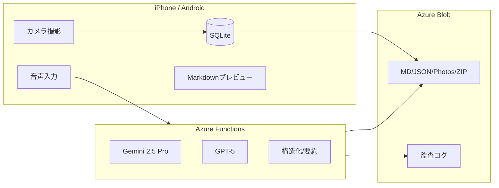

# 📘 Dynamic Field Note

> **現場動的要約・安全同期 出張報告アプリ**

音声入力と写真をリアルタイム構造化し、Markdownレポートとして即時生成。
「現場で95%、オフィスで5%仕上げる報告書」を実現します。

[](LICENSE)
[](https://expo.dev/)
[](https://www.typescriptlang.org/)
[](https://expo.dev/)

## 🎯 プロジェクト概要

| 項目                     | 内容                                                         |
| ------------------------ | ------------------------------------------------------------ |
| **プロジェクト名**       | Dynamic Field Note（動的現場ノート）                         |
| **開発目的**             | 現場での音声・写真・メモを動的に構造化し、報告書作成を自動化 |
| **主要プラットフォーム** | Azure (Functions / Blob Storage / Graph API)                 |
| **使用モデル**           | Gemini 2.5 Pro および GPT-5（Fast→Quality 二段要約）         |
| **開発方針**             | OSS優先（MIT／Apache 2.0）、商用利用可、再販可設計           |

## ✨ 主な機能

- 🎙 **音声入力**: 端末標準音声入力（5秒単位で蓄積、5分/無音30秒で送信）
- 🤖 **二段要約**: Gemini 2.5 Pro → GPT-5 連携で高精度要約
- 📸 **写真撮影**: 注釈機能（丸・矢印・テキスト描画）
- 🧠 **Markdown構造化**: 決定事項・ToDo・課題を自動整理
- ☁️ **クラウド同期**: Azure Blob / Graph API経由
- 🔐 **セキュリティ**: TLSピンニング＋署名ZIP＋ログ監査
- 📄 **出力**: Markdown / PDF / ZIP

## 📊 品質指標

### Lighthouse スコア（Expo Web）


### Core Web Vitals


**最終測定日**: 2025-10-20

詳細レポート: [PERFORMANCE_FINAL_REPORT.md](docs/PERFORMANCE_FINAL_REPORT.md)

## 🚀 クイックスタート

```bash
# 1. リポジトリのクローン
git clone https://github.com/Taguchi-1989/dynamic-field-note.git
cd dynamic-field-note

# 2. 依存関係のインストール
npm install

# 3. 開発サーバー起動
npm start
```

詳細は [開発環境構築ガイド](docs/setup-guide.md)（Phase 0で作成予定）を参照してください。

## 📂 プロジェクト構造

```
dynamic-field-note/
├── docs/                    # ドキュメント
│   ├── 企画書.md            # マスター企画書
│   ├── ROADMAP.md          # 開発ロードマップ
│   └── ...
├── src/                     # ソースコード（Phase 0で作成）
│   ├── components/         # UIコンポーネント
│   ├── screens/            # 画面
│   ├── services/           # ビジネスロジック・API
│   ├── hooks/              # カスタムフック
│   ├── types/              # 型定義
│   └── utils/              # ユーティリティ
├── azure-functions/         # Azure Functions（Phase 4で作成）
└── tests/                   # テスト（各フェーズで追加）
```

## 📋 開発ロードマップ

| フェーズ            | 期間 | 目的                 | 主タスク                      |
| ------------------- | ---- | -------------------- | ----------------------------- |
| **P0 環境構築**     | 1週  | 開発基盤整備         | Expo環境構築／iPhone 12ビルド |
| **P1 PoC**          | 2週  | 音声→要約→Markdown   | 標準音声入力／Gemini接続      |
| **P2 UI/UX整備**    | 2週  | プレビュー中心UI     | 中間/最終要約ボタン／メニュー |
| **P3 ローカル保存** | 3週  | 写真+注釈+ZIP        | SQLite/JSZip導入              |
| **P4 Azure連携**    | 3週  | Blob Storage連携     | HTTPS通信・TLSピンニング      |
| **P5 α版統合**      | 2週  | 総合統合／脆弱性試験 | GPT-5統合・PDF出力            |
| **P6 β・運用化**    | 継続 | 導入展開・MDM        | Intune登録／VPN化             |

詳細は [ROADMAP.md](docs/ROADMAP.md) を参照してください。

## 🏗️ アーキテクチャ



## 🔧 技術スタック

### フロントエンド

- React Native (Expo)
- TypeScript
- React Native Paper
- SQLite
- JSZip

### バックエンド

- Azure Functions (TypeScript)
- Azure Blob Storage
- Azure Key Vault

### AI/ML

- Google Gemini 2.5 Pro
- OpenAI GPT-5

## 📊 開発状況

現在のフェーズ: **Phase 2 完了（改善版） - UI/UX整備 + アクセシビリティ対応 🎉**

| フェーズ            | ステータス | 完了日     | 品質スコア |
| ------------------- | ---------- | ---------- | ---------- |
| **P0 環境構築**     | ✅ 完了    | 2025-10-17 | 5/5        |
| **P1 PoC**          | ✅ 完了    | 2025-10-17 | 5/5        |
| **P2 UI/UX整備**    | ✅ 完了    | 2025-10-18 | **5.0/5**  |
| **P3 ローカル保存** | 🔲 未着手  | -          | -          |
| **P4 Azure連携**    | 🔲 未着手  | -          | -          |
| **P5 α版統合**      | 🔲 未着手  | -          | -          |
| **P6 β・運用化**    | 🔲 未着手  | -          | -          |

### Phase 2 実装済み機能 ✨

#### コア機能

- ✅ リッチ Markdown プレビュー（react-native-markdown-display）
- ✅ FAB 要約ボタン（中間・最終まとめ）
- ✅ Drawer ナビゲーション（ハンバーガーメニュー）
- ✅ AI 状態表示インジケーター

#### Phase 2 改善機能（2025-10-18）

- 🎉 **AI 処理の進捗バー表示**（0% → 10% → 30% → 70% → 100%）
- 🎉 **アクセシビリティ対応**（フォントサイズ調整: 小・中・大）
- 🎉 **ダークモード準備完了**（Phase 2.5 で有効化予定）
- 🎉 **設定の永続化**（AsyncStorage による保存）

#### 品質保証

- ✅ TypeScript strict mode（エラー: 0 件）
- ✅ ESLint（警告: 0 件）
- ✅ Prettier（100%準拠）
- ✅ コード品質スコア: **5.0/5**

詳細は [Phase 2 改善レポート](docs/phase2-improvements.md) を参照してください。

進捗状況は [GitHub Issues](https://github.com/Taguchi-1989/dynamic-field-note/issues) で確認できます。

## 🤝 コントリビューション

現在、このプロジェクトは開発初期段階（PoC）のため、外部からのコントリビューションは受け付けていません。
β版以降で公開予定です。

## 📝 ライセンス

MIT License - 詳細は [LICENSE](LICENSE) ファイルを参照してください。

商用利用・再販可能です。

## 📚 ドキュメント

- [企画書（マスター）](docs/企画書.md) - プロジェクト全体の設計書
- [開発ロードマップ](docs/ROADMAP.md) - 詳細な開発計画
- [イシュー管理ガイド](https://github.com/Taguchi-1989/dynamic-field-note/issues/1) - 開発フロー

## 📞 お問い合わせ

プロジェクトに関する質問は [GitHub Issues](https://github.com/Taguchi-1989/dynamic-field-note/issues) で受け付けています。

---

**© 2025 Dynamic Field Note Project**
