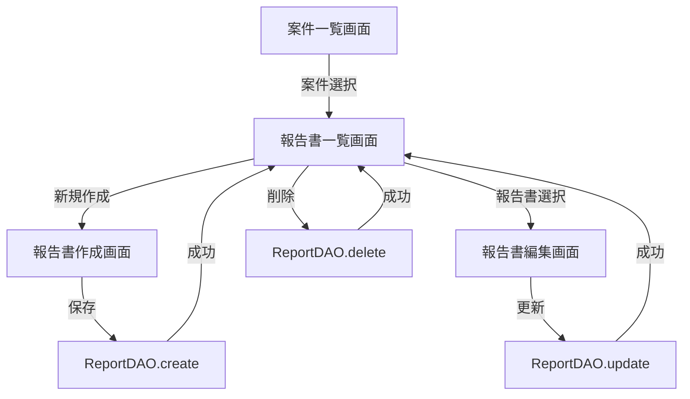

# Phase 3.4: 報告書作成・編集機能 - 実装計画

## 概要

**フェーズ**: Phase 3.4
**開始日**: 2025-10-18
**想定期間**: 3日
**ステータス**: 🚧 計画中

## 目的

案件に紐付いた報告書の作成・編集・管理機能を実装し、Markdown編集とプレビュー機能を統合する。

## 前提条件

### 完了している機能

- ✅ Phase 3.0: SQLite実装 (CaseDAO, ReportDAO, PhotoDAO)
- ✅ Phase 3.1: 案件管理システム (CaseListScreen, CaseFormModal)
- ✅ Phase 3.2: 写真キャプチャ機能 (CameraScreen)
- ✅ Phase 3.3: 写真アノテーション (PhotoAnnotator)

### 利用可能なリソース

- **データベース**: ReportDAOによる報告書CRUD操作
- **UI  コンポーネント**: MarkdownPreview (既存)
- **ナビゲーション**: DrawerNavigator (既存)
- **状態管理**: React Context API

## 実装タスク

### タスク1: 報告書一覧画面 (ReportListScreen)

**所要時間**: 1日

#### 機能要件

1. **報告書リスト表示**
   - 選択中の案件に紐付く報告書一覧を表示
   - タイトル、作成日時、更新日時を表示
   - 論理削除された報告書は非表示

2. **報告書選択**
   - タップで報告書詳細/編集画面に遷移
   - 長押しでコンテキストメニュー (削除)

3. **新規作成ボタン**
   - 右下FABボタンで報告書作成画面へ遷移

4. **空状態**
   - 報告書が0件の場合、案内メッセージ表示

#### 技術仕様

```typescript
// src/screens/ReportListScreen.tsx

interface ReportListScreenProps {
  route: RouteProp<RootStackParamList, 'ReportList'>;
  navigation: NavigationProp<RootStackParamList>;
}

export const ReportListScreen: React.FC<ReportListScreenProps> = ({ route, navigation }) => {
  const { caseId } = route.params;
  const [reports, setReports] = useState<Report[]>([]);
  const [loading, setLoading] = useState(true);

  useEffect(() => {
    loadReports();
  }, [caseId]);

  const loadReports = async () => {
    const reportDAO = new ReportDAO();
    const data = await reportDAO.findByCaseId(caseId);
    setReports(data);
    setLoading(false);
  };

  const handleDelete = async (reportId: number) => {
    const reportDAO = new ReportDAO();
    await reportDAO.delete(reportId);
    await loadReports();
  };

  return (
    <View style={styles.container}>
      <FlatList
        data={reports}
        keyExtractor={(item) => item.id.toString()}
        renderItem={({ item }) => (
          <ReportListItem
            report={item}
            onPress={() => navigation.navigate('ReportForm', { reportId: item.id, caseId })}
            onDelete={() => handleDelete(item.id)}
          />
        )}
        ListEmptyComponent={<EmptyState message="報告書がありません" />}
      />
      <FAB
        icon="plus"
        onPress={() => navigation.navigate('ReportForm', { caseId })}
        style={styles.fab}
      />
    </View>
  );
};
```

#### UIコンポーネント

```typescript
// src/components/ReportListItem.tsx

interface ReportListItemProps {
  report: Report;
  onPress: () => void;
  onDelete: () => void;
}

export const ReportListItem: React.FC<ReportListItemProps> = ({ report, onPress, onDelete }) => {
  return (
    <Card onPress={onPress} onLongPress={onDelete} style={styles.card}>
      <Card.Content>
        <Title>{report.title}</Title>
        <Paragraph>作成: {formatDate(report.created_at)}</Paragraph>
        <Paragraph>更新: {formatDate(report.updated_at)}</Paragraph>
      </Card.Content>
    </Card>
  );
};
```

### タスク2: 報告書作成・編集画面 (ReportFormScreen)

**所要時間**: 1.5日

#### 機能要件

1. **新規作成モード**
   - タイトル入力フィールド
   - Markdown本文入力エリア (TextInput)
   - リアルタイムプレビュー (MarkdownPreview)
   - 保存ボタン

2. **編集モード**
   - 既存報告書の読み込み
   - タイトル・本文の編集
   - プレビュー更新
   - 保存ボタン (更新)

3. **プレビュー切り替え**
   - タブまたはトグルボタンで編集/プレビューモード切り替え
   - 分割ビュー (可能であれば)

4. **自動保存**
   - 5秒間入力がない場合、自動的に下書き保存

5. **バリデーション**
   - タイトル必須チェック
   - タイトル100文字以内

#### 技術仕様

```typescript
// src/screens/ReportFormScreen.tsx

interface ReportFormScreenProps {
  route: RouteProp<RootStackParamList, 'ReportForm'>;
  navigation: NavigationProp<RootStackParamList>;
}

export const ReportFormScreen: React.FC<ReportFormScreenProps> = ({ route, navigation }) => {
  const { reportId, caseId } = route.params;
  const [title, setTitle] = useState('');
  const [content, setContent] = useState('');
  const [previewMode, setPreviewMode] = useState(false);
  const [saving, setSaving] = useState(false);

  useEffect(() => {
    if (reportId) {
      loadReport(reportId);
    }
  }, [reportId]);

  // 自動保存ロジック
  useEffect(() => {
    const timer = setTimeout(() => {
      if (title || content) {
        handleSave(true); // isDraft = true
      }
    }, 5000);
    return () => clearTimeout(timer);
  }, [title, content]);

  const loadReport = async (id: number) => {
    const reportDAO = new ReportDAO();
    const report = await reportDAO.findById(id);
    if (report) {
      setTitle(report.title);
      setContent(report.content || '');
    }
  };

  const handleSave = async (isDraft = false) => {
    if (!title.trim()) {
      Alert.alert('エラー', 'タイトルを入力してください');
      return;
    }

    setSaving(true);
    const reportDAO = new ReportDAO();

    try {
      if (reportId) {
        // 更新
        await reportDAO.update(reportId, { title, content });
      } else {
        // 新規作成
        await reportDAO.create({
          case_id: caseId,
          title,
          content,
        });
      }

      if (!isDraft) {
        navigation.goBack();
      }
    } catch (error) {
      Alert.alert('エラー', '保存に失敗しました');
    } finally {
      setSaving(false);
    }
  };

  return (
    <View style={styles.container}>
      <View style={styles.header}>
        <TextInput
          placeholder="報告書タイトル"
          value={title}
          onChangeText={setTitle}
          maxLength={100}
          style={styles.titleInput}
        />
        <View style={styles.headerButtons}>
          <Button
            mode={previewMode ? 'outlined' : 'contained'}
            onPress={() => setPreviewMode(!previewMode)}
          >
            {previewMode ? '編集' : 'プレビュー'}
          </Button>
          <Button
            mode="contained"
            onPress={() => handleSave(false)}
            loading={saving}
          >
            保存
          </Button>
        </View>
      </View>

      {previewMode ? (
        <ScrollView style={styles.preview}>
          <MarkdownPreview content={content} />
        </ScrollView>
      ) : (
        <TextInput
          placeholder="Markdown形式で入力..."
          value={content}
          onChangeText={setContent}
          multiline
          style={styles.contentInput}
        />
      )}
    </View>
  );
};
```

### タスク3: ナビゲーション統合

**所要時間**: 0.5日

#### 実装内容

1. **ルート定義追加**

```typescript
// src/navigation/types.ts

export type RootStackParamList = {
  // 既存
  Home: undefined;
  CaseList: undefined;
  CaseForm: { caseId?: number };
  Camera: { caseId: number };

  // 新規追加
  ReportList: { caseId: number };
  ReportForm: { caseId: number; reportId?: number };
};
```

2. **DrawerNavigator更新**

```typescript
// src/navigation/DrawerNavigator.tsx

<Drawer.Screen
  name="ReportList"
  component={ReportListScreen}
  options={{
    drawerLabel: '報告書一覧',
    drawerIcon: ({ color }) => <Icon name="file-document" color={color} size={24} />,
  }}
/>
```

3. **案件一覧から報告書一覧への遷移**

```typescript
// src/screens/CaseListScreen.tsx に追加

const handleCasePress = (caseId: number) => {
  navigation.navigate('ReportList', { caseId });
};
```

## データフロー



## テスト計画

### 単体テスト

既存の `ReportDAO.test.ts` で以下をカバー済み:

- ✅ 報告書CRUD操作
- ✅ 案件別検索 (findByCaseId)
- ✅ タイトル・内容検索
- ✅ 件数カウント

### E2Eテスト (追加予定)

```typescript
// e2e/comprehensive/report-management.test.ts

describe('報告書管理機能 E2E', () => {
  it('should create new report', async () => {
    // 案件作成
    const caseDAO = new CaseDAO();
    const caseId = await caseDAO.create({ title: 'テスト案件', status: 'active' });

    // 報告書作成
    const reportDAO = new ReportDAO();
    const reportId = await reportDAO.create({
      case_id: caseId,
      title: 'テスト報告書',
      content: '# 見出し\n\nテスト内容',
    });

    // 検証
    const report = await reportDAO.findById(reportId);
    expect(report).toBeDefined();
    expect(report!.title).toBe('テスト報告書');
  });

  it('should update existing report', async () => {
    // 報告書更新テスト
  });

  it('should delete report', async () => {
    // 報告書削除テスト
  });

  it('should list reports by case', async () => {
    // 案件別報告書一覧テスト
  });
});
```

### UIテスト (手動確認項目)

- [ ] 報告書一覧が正しく表示される
- [ ] 新規作成画面でタイトル・内容を入力できる
- [ ] プレビューモードでMarkdownが正しくレンダリングされる
- [ ] 保存ボタンで報告書が保存される
- [ ] 編集画面で既存報告書が読み込まれる
- [ ] 更新ボタンで報告書が更新される
- [ ] 削除ボタンで報告書が論理削除される
- [ ] 自動保存が5秒後に動作する

## 非機能要件

### パフォーマンス

- 報告書一覧表示: < 100ms
- 報告書読み込み: < 50ms
- 保存処理: < 100ms
- Markdownプレビュー: リアルタイム (入力と同期)

### ユーザビリティ

- タイトル入力フィールドは常に画面上部に固定
- Markdown編集エリアは画面の60%以上を占める
- プレビュー切り替えは1タップで可能
- 保存完了時にトースト通知を表示

### アクセシビリティ

- すべての入力フィールドにラベル
- ボタンに適切な説明テキスト
- フォントサイズ調整対応

## リスクと対応

| リスク | 影響度 | 対策 |
|--------|--------|------|
| Markdown編集時のパフォーマンス低下 | 中 | デバウンス処理、プレビュー更新の最適化 |
| 自動保存の競合 | 低 | 最後の入力から5秒後に保存、保存中は再保存しない |
| 大量の報告書表示時のメモリ不足 | 低 | ページネーションまたは仮想化リスト導入 |

## 成功基準

### 機能要件

- ✅ 報告書の新規作成ができる
- ✅ 報告書の編集・更新ができる
- ✅ 報告書の削除ができる
- ✅ 案件別に報告書一覧が表示される
- ✅ Markdownプレビューが正しく表示される

### 品質要件

- ✅ E2Eテスト5件以上作成・合格
- ✅ TypeScript型エラー0件
- ✅ ESLint/Prettier準拠
- ✅ 実機で動作確認完了

### UX要件

- ✅ 報告書作成から保存まで10ステップ以内
- ✅ プレビュー切り替えが1秒以内
- ✅ 自動保存が正しく動作

## スケジュール

| 日 | タスク | 成果物 |
|----|--------|--------|
| Day 1 | ReportListScreen実装 | 報告書一覧画面 |
| Day 2 | ReportFormScreen実装 (1/2) | 基本的な作成・編集機能 |
| Day 3 | ReportFormScreen実装 (2/2) + テスト | プレビュー統合、E2Eテスト |

## 次フェーズへの引き継ぎ

### Phase 3.5への準備

報告書管理機能完成後、以下の機能実装に必要な基盤が整う:

- **ZIP生成**: 案件+報告書+写真を1つのアーカイブに
- **エクスポート**: 報告書をPDF/Markdown形式で出力
- **同期**: Azure Blob Storageへの報告書アップロード

## 参照ドキュメント

- [ROADMAP.md](./ROADMAP.md) - プロジェクトロードマップ
- [sqlite-schema.md](./sqlite-schema.md) - データベーススキーマ
- [COMPREHENSIVE_TEST_REPORT.md](./COMPREHENSIVE_TEST_REPORT.md) - テスト品質基準

---

**作成日**: 2025-10-18
**ステータス**: 🚧 計画完了・実装開始待ち
**次のアクション**: Phase 3.4実装開始
