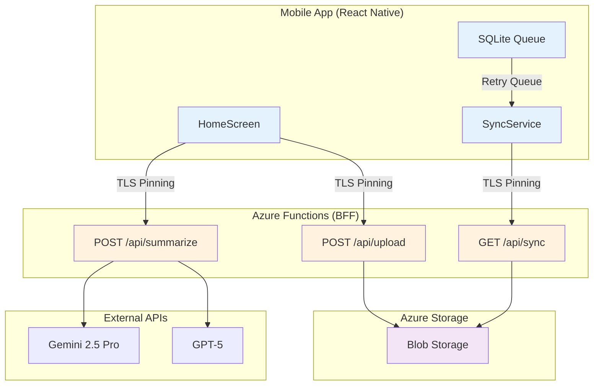
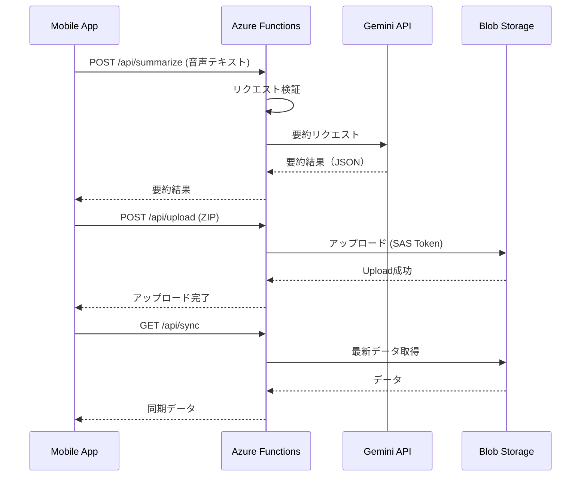

# ☁️ Phase 4: AWS連携 - 実装計画書

**作成日**: 2025-10-18
**最終更新**: 2025-10-18（デプロイ先をAWSに変更）
**ステータス**: 計画中
**期間**: 3週間（予定）

---

## 📋 目次

1. [概要](#概要)
2. [アーキテクチャ](#アーキテクチャ)
3. [実装タスク](#実装タスク)
4. [API設計](#api設計)
5. [セキュリティ](#セキュリティ)
6. [テスト計画](#テスト計画)

---

## 概要

### 目的

AWS Lambda（BFF: Backend For Frontend）とS3を使用して、安全なクラウド同期機能を実装する。

### 主要機能

1. **AWS Lambda BFF**
   - AI要約APIのプロキシ
   - リクエスト検証・レート制限
   - セキュアな通信
   - API Gateway統合

2. **S3連携**
   - ZIP/写真のクラウドストレージ
   - Pre-signed URLによる安全なアクセス
   - 同期機能
   - バージョニング管理

3. **TLSピンニング**
   - 証明書検証による中間者攻撃対策
   - セキュア通信の保証

4. **同期キュー**
   - オフライン時の操作キュー
   - 指数バックオフによる再送制御
   - 同期状態管理

---

## アーキテクチャ

### システム構成図



### データフロー



---

## 実装タスク

### ✅ Phase 0-3 完了済み

- [x] Phase 0: 環境構築
- [x] Phase 1: PoC（音声入力、Gemini連携、Markdown）
- [x] Phase 2: UI/UX整備
- [x] Phase 3: ローカル保存（SQLite）

### 🔜 Phase 4: Azure連携（3週間）

#### タスク4-1: Azure Functions BFF 構築（4日）

**優先度**: 🔴 HIGH

**目的**: AIAPIのプロキシとして機能するBFFを構築

**実装内容**:

1. **プロジェクト初期化**

   ```bash
   # Azure Functions プロジェクト作成
   mkdir azure-functions
   cd azure-functions
   npm init -y
   npm install @azure/functions typescript
   npx tsc --init
   ```

2. **エンドポイント実装**

   **POST /api/summarize**

   ```typescript
   // azure-functions/summarize/index.ts
   import { app, HttpRequest, HttpResponseInit, InvocationContext } from '@azure/functions';
   import { GoogleGenerativeAI } from '@google/generative-ai';

   export async function summarize(
     request: HttpRequest,
     context: InvocationContext
   ): Promise<HttpResponseInit> {
     try {
       const { text } = await request.json();

       // リクエスト検証
       if (!text || text.length > 10000) {
         return { status: 400, body: 'Invalid request' };
       }

       // Gemini呼び出し
       const genAI = new GoogleGenerativeAI(process.env.GEMINI_API_KEY);
       const model = genAI.getGenerativeModel({ model: 'gemini-2.5-pro' });
       const result = await model.generateContent(text);

       return {
         status: 200,
         body: JSON.stringify(result.response.text()),
       };
     } catch (error) {
       context.error('Summarize error:', error);
       return { status: 500, body: 'Internal server error' };
     }
   }

   app.http('summarize', {
     methods: ['POST'],
     authLevel: 'function',
     handler: summarize,
   });
   ```

   **POST /api/upload**

   ```typescript
   // azure-functions/upload/index.ts
   import { BlobServiceClient } from '@azure/storage-blob';

   export async function upload(
     request: HttpRequest,
     context: InvocationContext
   ): Promise<HttpResponseInit> {
     // Multipart form data処理
     // Blob Storageへアップロード
   }
   ```

   **GET /api/sync**

   ```typescript
   // azure-functions/sync/index.ts
   export async function sync(
     request: HttpRequest,
     context: InvocationContext
   ): Promise<HttpResponseInit> {
     // 最新の同期データを取得
   }
   ```

3. **リクエスト検証**

   ```typescript
   import Ajv from 'ajv';

   const ajv = new Ajv();
   const summarizeSchema = {
     type: 'object',
     properties: {
       text: { type: 'string', minLength: 1, maxLength: 10000 },
       language: { type: 'string', enum: ['ja', 'en'] },
     },
     required: ['text'],
   };

   const validate = ajv.compile(summarizeSchema);
   ```

4. **レート制限**

   ```typescript
   // 1ユーザーあたり 60リクエスト/分
   const rateLimiter = new Map();

   function checkRateLimit(userId: string): boolean {
     const now = Date.now();
     const userRequests = rateLimiter.get(userId) || [];
     const recentRequests = userRequests.filter((t) => now - t < 60000);

     if (recentRequests.length >= 60) {
       return false;
     }

     recentRequests.push(now);
     rateLimiter.set(userId, recentRequests);
     return true;
   }
   ```

**成果物**:

- `azure-functions/` フォルダ
- 3つのエンドポイント実装
- API仕様書（OpenAPI形式）

**見積工数**: 4日

---

#### タスク4-2: Blob Storage 連携（3日）

**優先度**: 🟡 MEDIUM

**目的**: ZIP/写真をAzure Blob Storageに安全にアップロード

**実装内容**:

1. **Azure Storage Account 作成**

   ```bash
   # Azure CLI
   az storage account create \
     --name dynamicfieldnote \
     --resource-group rg-dynamic-field-note \
     --location japaneast \
     --sku Standard_LRS
   ```

2. **コンテナ設計**

   ```
   cases/
     ├── {case_id}/
     │   ├── reports/
     │   │   └── {report_id}.zip
     │   └── photos/
     │       └── {photo_id}.jpg
   logs/
     └── audit/
         └── {year}/{month}/{day}/
   ```

3. **SAS Token 生成**

   ```typescript
   import {
     BlobServiceClient,
     StorageSharedKeyCredential,
     generateBlobSASQueryParameters,
     BlobSASPermissions,
   } from '@azure/storage-blob';

   function generateSASToken(containerName: string, blobName: string): string {
     const sasOptions = {
       containerName,
       blobName,
       permissions: BlobSASPermissions.parse('r'), // 読み取り専用
       startsOn: new Date(),
       expiresOn: new Date(new Date().valueOf() + 3600 * 1000), // 1時間
     };

     return generateBlobSASQueryParameters(sasOptions, sharedKeyCredential).toString();
   }
   ```

4. **アップロード実装（アプリ側）**

   ```typescript
   // src/services/AzureSyncService.ts
   export class AzureSyncService {
     async uploadZip(caseId: number, zipPath: string): Promise<void> {
       // 1. BFFからSASトークン取得
       const { sasUrl } = await fetch(`${API_BASE}/api/upload/token`, {
         method: 'POST',
         body: JSON.stringify({ caseId }),
       }).then((r) => r.json());

       // 2. Blob Storageに直接アップロード
       const response = await fetch(sasUrl, {
         method: 'PUT',
         headers: {
           'x-ms-blob-type': 'BlockBlob',
           'Content-Type': 'application/zip',
         },
         body: await FileSystem.readAsStringAsync(zipPath, {
           encoding: FileSystem.EncodingType.Base64,
         }),
       });

       if (!response.ok) {
         throw new Error('Upload failed');
       }
     }
   }
   ```

**成果物**:

- Blob Storage設定
- アップロード/ダウンロード実装
- 統合テスト

**見積工数**: 3日

---

#### タスク4-3: TLSピンニング実装（2日）

**優先度**: 🔴 HIGH（セキュリティ）

**目的**: 中間者攻撃対策

**実装内容**:

1. **証明書取得**

   ```bash
   # Azure Functionsの証明書を取得
   openssl s_client -connect dynamicfieldnote.azurewebsites.net:443 \
     < /dev/null | openssl x509 -outform PEM > azure-cert.pem

   # 証明書のSHA-256フィンガープリント取得
   openssl x509 -in azure-cert.pem -pubkey -noout | \
     openssl pkey -pubin -outform der | \
     openssl dgst -sha256 -binary | openssl enc -base64
   ```

2. **React Native実装**

   ```typescript
   // src/services/SecureHttpClient.ts
   import { Platform } from 'react-native';

   const AZURE_CERT_SHA256 = 'BASE64_ENCODED_SHA256_HASH';

   export class SecureHttpClient {
     async fetch(url: string, options: RequestInit): Promise<Response> {
       if (Platform.OS === 'web') {
         // Web環境ではブラウザのTLS検証を使用
         return fetch(url, options);
       }

       // Native環境でTLSピンニング
       // expo-ssl-pinning または react-native-ssl-pinning 使用
       return sslPinning.fetch(url, {
         ...options,
         sslPinning: {
           certs: [AZURE_CERT_SHA256],
         },
       });
     }
   }
   ```

3. **証明書検証失敗時のエラーハンドリング**
   ```typescript
   try {
     await secureHttpClient.fetch(url, options);
   } catch (error) {
     if (error.code === 'CERTIFICATE_MISMATCH') {
       Alert.alert(
         'セキュリティエラー',
         '通信の安全性を確認できませんでした。アプリを最新版に更新してください。'
       );
     }
   }
   ```

**成果物**:

- TLSピンニング実装
- 証明書管理手順書
- エラーハンドリング

**見積工数**: 2日

---

#### タスク4-4: 同期キュー・再送制御（3日）

**優先度**: 🟡 MEDIUM

**目的**: オフライン時の操作をキューイングし、オンライン復帰時に自動同期

**実装内容**:

1. **同期キューテーブル（SQLite）**

   ```sql
   CREATE TABLE IF NOT EXISTS sync_queue (
     id INTEGER PRIMARY KEY AUTOINCREMENT,
     entity_type TEXT NOT NULL,          -- 'case' | 'report' | 'photo'
     entity_id INTEGER NOT NULL,
     operation TEXT NOT NULL,            -- 'create' | 'update' | 'delete'
     payload TEXT,                       -- JSON形式
     retry_count INTEGER NOT NULL DEFAULT 0,
     last_error TEXT,
     created_at TEXT NOT NULL DEFAULT (datetime('now', 'localtime')),
     synced_at TEXT,
     CHECK (entity_type IN ('case', 'report', 'photo')),
     CHECK (operation IN ('create', 'update', 'delete'))
   );
   ```

2. **同期サービス実装**

   ```typescript
   // src/services/SyncService.ts
   export class SyncService {
     private maxRetries = 5;
     private baseDelay = 1000; // 1秒

     async processQueue(): Promise<void> {
       const queue = await this.db.getAllAsync(
         'SELECT * FROM sync_queue WHERE synced_at IS NULL ORDER BY created_at ASC'
       );

       for (const item of queue) {
         await this.processQueueItem(item);
       }
     }

     private async processQueueItem(item: SyncQueueItem): Promise<void> {
       try {
         // API呼び出し
         await this.syncToAzure(item);

         // 成功したらsynced_atを更新
         await this.db.runAsync('UPDATE sync_queue SET synced_at = ? WHERE id = ?', [
           new Date().toISOString(),
           item.id,
         ]);
       } catch (error) {
         // エラー時は指数バックオフ
         const retryCount = item.retry_count + 1;
         const delay = this.baseDelay * Math.pow(2, retryCount); // 1s, 2s, 4s, 8s, 16s

         await this.db.runAsync(
           'UPDATE sync_queue SET retry_count = ?, last_error = ? WHERE id = ?',
           [retryCount, error.message, item.id]
         );

         if (retryCount < this.maxRetries) {
           setTimeout(() => this.processQueueItem(item), delay);
         }
       }
     }
   }
   ```

3. **ネットワーク監視**

   ```typescript
   import NetInfo from '@react-native-community/netinfo';

   NetInfo.addEventListener((state) => {
     if (state.isConnected) {
       // オンライン復帰時に同期開始
       syncService.processQueue();
     }
   });
   ```

4. **同期履歴画面**

   ```typescript
   // src/screens/SyncHistoryScreen.tsx
   export const SyncHistoryScreen: React.FC = () => {
     const [syncQueue, setSyncQueue] = useState([]);

     useEffect(() => {
       loadSyncQueue();
     }, []);

     return (
       <FlatList
         data={syncQueue}
         renderItem={({ item }) => (
           <View>
             <Text>{item.entity_type} - {item.operation}</Text>
             <Text>Retries: {item.retry_count}</Text>
             {item.last_error && <Text>Error: {item.last_error}</Text>}
           </View>
         )}
       />
     );
   };
   ```

**成果物**:

- `services/SyncService.ts`
- 同期キューテーブル
- 同期履歴UI

**見積工数**: 3日

---

#### タスク4-5: 通信安全テスト（2日）

**優先度**: 🔴 HIGH

**目的**: セキュリティとエラーハンドリングの検証

**テスト項目**:

1. **中間者攻撃シミュレーション**

   ```bash
   # mitmproxyでテスト
   mitmproxy --mode transparent --showhost

   # 期待結果: TLSピンニングにより接続失敗
   ```

2. **証明書不一致テスト**
   - 無効な証明書でサーバー起動
   - アプリからリクエスト
   - 期待: エラーダイアログ表示、通信失敗

3. **ネットワーク断絶テスト**

   ```typescript
   // 機内モードON
   // → 操作実行
   // → 同期キューに追加されることを確認

   // 機内モードOFF
   // → 自動同期開始
   // → キュー処理完了を確認
   ```

4. **再送制御テスト**
   - APIタイムアウト設定（1秒）
   - リクエスト送信
   - 期待: 1秒 → 2秒 → 4秒 → 8秒 → 16秒でリトライ

**成果物**:

- セキュリティテストレポート
- エラーハンドリングテスト結果

**見積工数**: 2日

---

## API設計

### エンドポイント仕様

#### POST /api/summarize

**リクエスト**:

```json
{
  "text": "音声文字起こしテキスト",
  "language": "ja",
  "model": "gemini-2.5-pro"
}
```

**レスポンス**:

```json
{
  "summary": {
    "title": "議事録タイトル",
    "participants": ["山田", "佐藤"],
    "topics": [...],
    "decisions": [...],
    "todos": [...]
  },
  "processingTime": 3456
}
```

---

#### POST /api/upload

**リクエスト**:

```json
{
  "caseId": 123,
  "fileType": "zip"
}
```

**レスポンス**:

```json
{
  "sasUrl": "https://dynamicfieldnote.blob.core.windows.net/cases/123/report.zip?sv=...",
  "expiresAt": "2025-10-18T12:00:00Z"
}
```

---

#### GET /api/sync

**リクエスト**: クエリパラメータ

```
GET /api/sync?lastSyncAt=2025-10-18T00:00:00Z
```

**レスポンス**:

```json
{
  "cases": [...],
  "reports": [...],
  "photos": [...],
  "deletedIds": {
    "cases": [1, 2],
    "reports": [3]
  }
}
```

---

## セキュリティ

### セキュリティ要件

1. **通信の暗号化**
   - ✅ TLS 1.3以上
   - ✅ TLSピンニング
   - ✅ 証明書検証

2. **認証・認可**
   - Azure AD B2C（将来対応）
   - Functionレベルの認証キー

3. **データ保護**
   - ✅ SASトークンは短命（1時間）
   - ✅ 読み取り専用トークン
   - ✅ 最小権限の原則

4. **監査ログ**
   - 全API呼び出しをログ記録
   - Blob Storageに保存

---

## テスト計画

### 単体テスト

- Azure Functions: Jest
- React Native: Jest + React Native Testing Library

### 統合テスト

- Azure Functions ↔ Gemini API
- Azure Functions ↔ Blob Storage
- アプリ ↔ Azure Functions

### E2Eテスト

1. 音声入力 → 要約 → アップロード → 同期
2. オフライン → オンライン復帰 → 自動同期
3. エラー発生 → リトライ → 成功

---

## スケジュール

| タスク              | 期間 | 担当 | 状態   |
| ------------------- | ---- | ---- | ------ |
| T4-1: BFF構築       | 4日  | -    | 未着手 |
| T4-2: Blob Storage  | 3日  | -    | 未着手 |
| T4-3: TLSピンニング | 2日  | -    | 未着手 |
| T4-4: 同期キュー    | 3日  | -    | 未着手 |
| T4-5: 安全テスト    | 2日  | -    | 未着手 |

**合計**: 14日（約3週間）

---

## 次のステップ

Phase 4完了後:

1. **Phase 5**: α版統合
   - GPT-5二段要約
   - 監査ログ（WORM）
   - PDF出力

2. **Phase 6**: β・運用化
   - Intune MDM連携
   - 現場導入試験
   - 運用マニュアル

---

**関連ドキュメント**:

- [ROADMAP.md](./ROADMAP.md) - 全体ロードマップ
- [POC_DEMO_GUIDE.md](./POC_DEMO_GUIDE.md) - PoC機能デモ
- [DEVELOPMENT_ENVIRONMENT_SETUP.md](./DEVELOPMENT_ENVIRONMENT_SETUP.md) - 開発環境
