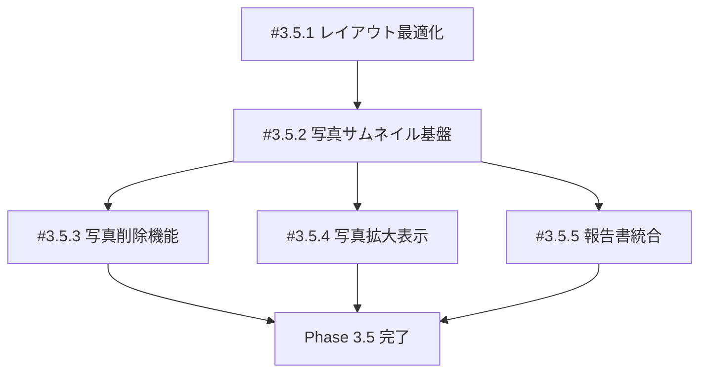

# Phase 3.5: 写真サムネイル機能 - 実装管理

**作成日**: 2025-10-18
**フェーズ**: Phase 3.5 - 写真サムネイル機能
**総工数見積**: 13-18時間

---

## 📋 概要

Dynamic Field Noteに写真サムネイル機能を追加し、現場報告書に写真を添付できるようにします。

### 主な機能

1. **レイアウト最適化** - 音声入力欄を広く
2. **写真撮影→サムネイル表示** - カメラ撮影後、HomeScreen下部にサムネイル表示
3. **写真削除** - サムネイル右上の×ボタンで削除（確認ダイアログ付き）
4. **写真拡大表示** - サムネイルタップで拡大モーダル表示
5. **報告書統合** - 報告書保存時、Markdownに写真パス埋め込み

---

## 🎯 確定仕様

| 項目                 | 仕様                                         |
| -------------------- | -------------------------------------------- |
| **写真上限**         | 10 枚/報告書                                 |
| **サムネイルサイズ** | 200x200px                                    |
| **写真削除**         | 論理削除（is_deleted = 1）                   |
| **案件との紐付け**   | 案件（Case）に紐付ける                       |
| **報告書添付**       | 報告書（Report）に写真を添付                 |
| **拡大表示**         | タップで拡大モーダル表示                     |
| **編集機能**         | Phase 3.5 では実装しない（注釈機能は未使用） |
| **カメラ撮影後**     | HomeScreen に自動遷移                        |

---

## 📝 イシュー一覧

### 進捗状況

| Issue  | タイトル           | 優先度 | 工数 | ステータス | 依存   |
| ------ | ------------------ | ------ | ---- | ---------- | ------ |
| #3.5.1 | レイアウト最適化   | MEDIUM | 1-2h | TODO       | -      |
| #3.5.2 | 写真サムネイル基盤 | HIGH   | 5-6h | TODO       | -      |
| #3.5.3 | 写真削除機能       | HIGH   | 2-3h | TODO       | #3.5.2 |
| #3.5.4 | 写真拡大表示       | MEDIUM | 2-3h | TODO       | #3.5.2 |
| #3.5.5 | 報告書統合         | HIGH   | 3-4h | TODO       | #3.5.2 |

**総工数**: 13-18 時間

---

## 🔄 実装順序



**推奨順序**:

1. **#3.5.1** - レイアウト最適化（独立作業）
2. **#3.5.2** - 写真サムネイル基盤（最重要）
3. **#3.5.3** - 写真削除機能（#3.5.2 依存）
4. **#3.5.4** - 写真拡大表示（#3.5.2 依存）
5. **#3.5.5** - 報告書統合（#3.5.2 依存）

---

## 📦 新規作成ファイル

### カスタムフック

- [x] `src/hooks/usePhotoManager.ts` (100-150 行)

### コンポーネント

- [x] `src/components/PhotoThumbnailGrid.tsx` (150-200 行)
- [x] `src/components/PhotoViewerModal.tsx` (80-100 行)

### ユーティリティ

- [x] `src/utils/imageUtils.ts` (30-50 行)
- [x] `src/utils/reportUtils.ts` (50-80 行)

### テスト

- [x] `src/hooks/__tests__/usePhotoManager.test.ts` (15-20 件)
- [x] `src/components/__tests__/PhotoThumbnailGrid.test.ts` (15-20 件)
- [x] `src/components/__tests__/PhotoViewerModal.test.ts` (8-10 件)

---

## 🛠️ 技術スタック

### 既存の使用

- ✅ expo-camera（写真撮影）
- ✅ expo-file-system（ファイル管理）
- ✅ expo-sqlite（PhotoDAO）
- ✅ react-native-paper（UI コンポーネント）

### 新規追加

- [ ] expo-image-manipulator（サムネイル生成）

```bash
npm install expo-image-manipulator
```

---

## 📊 データフロー

### 写真追加フロー

```
1. ユーザーが「写真」ボタンをタップ
   ↓
2. CameraScreen に遷移
   ↓
3. 写真撮影（takePictureAsync）
   ↓
4. HomeScreen に戻る（navigation.navigate('Home', { photoUri })）
   ↓
5. usePhotoManager.addPhoto(uri) 実行
   ↓
6. サムネイル生成（imageUtils.generateThumbnail）
   ↓
7. PhotoDAO.create({ file_path, thumbnail_path, ... })
   ↓
8. photos state 更新
   ↓
9. PhotoThumbnailGrid 再描画
```

### 写真削除フロー

```
1. ユーザーがサムネイル右上の×ボタンをタップ
   ↓
2. 削除確認ダイアログ表示
   ↓
3. 「はい」をタップ
   ↓
4. PhotoDAO.delete(id) - is_deleted = 1
   ↓
5. photos state から削除
   ↓
6. PhotoThumbnailGrid 再描画
```

### 報告書保存フロー

```
1. ユーザーが報告書を保存
   ↓
2. ReportDAO.create({ content: markdownWithPhotos, ... })
   ↓
3. 写真の report_id 更新（PhotoDAO.update）
   ↓
4. ファイル整理（reports/report_XXX/photos/）
   ↓
5. Markdown に写真パス埋め込み
   ↓
6. 完了
```

---

## ✅ 完了基準

### 機能要件

- [x] 音声入力欄が1画面に収まる範囲で最大限広い
- [x] 写真10枚まで追加可能
- [x] サムネイル表示（横スクロール）
- [x] タップで拡大表示
- [x] ×ボタンで削除（確認ダイアログ）
- [x] カメラ撮影後、HomeScreenに自動遷移
- [x] 報告書保存時、Markdownに写真パス埋め込み
- [x] 案件（Case）に写真を紐付け
- [x] 報告書（Report）に写真を添付

### 品質要件

- [x] TypeScript: 0 エラー（strict mode）
- [x] ESLint: 0 警告（max-warnings: 0）
- [x] Prettier: 100% 準拠
- [x] Tests: 全テストパス（48-60 件）
- [x] Smoke Tests: 実行時間 < 1 分
- [x] ガードレール: 全パス

---

## 📚 関連ドキュメント

### イシュー詳細

- [Issue #3.5.1 - レイアウト最適化](./PHASE_3_5_1_LAYOUT_OPTIMIZATION.md)
- [Issue #3.5.2 - 写真サムネイル基盤](./PHASE_3_5_2_PHOTO_THUMBNAIL_INTEGRATION.md)
- [Issue #3.5.3 - 写真削除機能](./PHASE_3_5_3_PHOTO_DELETE_FUNCTION.md)
- [Issue #3.5.4 - 写真拡大表示](./PHASE_3_5_4_PHOTO_VIEWER_MODAL.md)
- [Issue #3.5.5 - 報告書統合](./PHASE_3_5_5_REPORT_PHOTO_INTEGRATION.md)

### 技術仕様

- [SQLite スキーマ](../sqlite-schema.md) - photos テーブル定義
- [PhotoDAO](../../src/dao/PhotoDAO.ts) - CRUD 操作
- [Case 型定義](../../src/types/case.ts) - Photo インターフェース

---

## 🚀 GitHubイシュー登録

各イシューを GitHub Issues に登録する場合：

```bash
# gh CLI使用例
gh issue create \
  --title "[Phase 3.5.1] 音声入力欄のレイアウト最適化" \
  --body-file docs/issues/PHASE_3_5_1_LAYOUT_OPTIMIZATION.md \
  --label "phase-3,enhancement" \
  --assignee @me

gh issue create \
  --title "[Phase 3.5.2] 写真サムネイル基盤" \
  --body-file docs/issues/PHASE_3_5_2_PHOTO_THUMBNAIL_INTEGRATION.md \
  --label "phase-3,feature,high-priority" \
  --assignee @me

# ... 以下同様
```

または GitHub UI から手動で作成し、各ドキュメントの内容をコピー&ペースト。

---

**次のステップ**: [Issue #3.5.1 レイアウト最適化](./PHASE_3_5_1_LAYOUT_OPTIMIZATION.md) から実装開始
