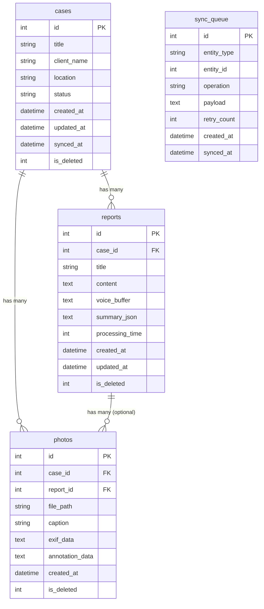

# SQLite データベーススキーマ設計

**作成日**: 2025-10-18
**Phase**: 3.0 - ローカル保存機能

---

## 📋 目次

1. [概要](#概要)
2. [テーブル設計](#テーブル設計)
3. [リレーションシップ](#リレーションシップ)
4. [インデックス設計](#インデックス設計)
5. [マイグレーション戦略](#マイグレーション戦略)

---

## 概要

Dynamic Field Noteのローカルデータベースは、以下の目的で設計されています：

- **案件管理**: 現場報告書を案件単位で管理
- **オフライン対応**: ネットワークなしでも完全動作
- **同期準備**: Phase 4でのクラウド同期に備えた設計
- **データ整合性**: 外部キー制約による参照整合性保証

---

## テーブル設計

### 1. `cases` テーブル - 案件管理

現場報告書の案件（プロジェクト）を管理します。

```sql
CREATE TABLE IF NOT EXISTS cases (
  id INTEGER PRIMARY KEY AUTOINCREMENT,
  title TEXT NOT NULL,
  client_name TEXT,
  location TEXT,
  description TEXT,
  status TEXT NOT NULL DEFAULT 'active',
  created_at TEXT NOT NULL DEFAULT (datetime('now', 'localtime')),
  updated_at TEXT NOT NULL DEFAULT (datetime('now', 'localtime')),
  synced_at TEXT,
  is_deleted INTEGER NOT NULL DEFAULT 0,

  CHECK (status IN ('active', 'completed', 'archived')),
  CHECK (is_deleted IN (0, 1))
);
```

**フィールド説明:**

| フィールド    | 型      | 説明                                   |
| ------------- | ------- | -------------------------------------- |
| `id`          | INTEGER | 主キー（自動採番）                     |
| `title`       | TEXT    | 案件タイトル（必須）                   |
| `client_name` | TEXT    | 顧客名                                 |
| `location`    | TEXT    | 現場住所                               |
| `description` | TEXT    | 案件説明                               |
| `status`      | TEXT    | ステータス: active/completed/archived  |
| `created_at`  | TEXT    | 作成日時（ISO 8601）                   |
| `updated_at`  | TEXT    | 更新日時（ISO 8601）                   |
| `synced_at`   | TEXT    | 最終同期日時（Phase 4）                |
| `is_deleted`  | INTEGER | 論理削除フラグ（0: 有効, 1: 削除済み） |

**制約:**

- `status`: 'active', 'completed', 'archived' のみ許可
- `is_deleted`: 0 または 1 のみ許可

---

### 2. `reports` テーブル - 報告書管理

各案件に紐づく報告書（Markdown）を管理します。

```sql
CREATE TABLE IF NOT EXISTS reports (
  id INTEGER PRIMARY KEY AUTOINCREMENT,
  case_id INTEGER NOT NULL,
  title TEXT NOT NULL,
  content TEXT,
  voice_buffer TEXT,
  summary_json TEXT,
  processing_time INTEGER,
  created_at TEXT NOT NULL DEFAULT (datetime('now', 'localtime')),
  updated_at TEXT NOT NULL DEFAULT (datetime('now', 'localtime')),
  is_deleted INTEGER NOT NULL DEFAULT 0,

  FOREIGN KEY (case_id) REFERENCES cases(id) ON DELETE CASCADE,
  CHECK (is_deleted IN (0, 1))
);
```

**フィールド説明:**

| フィールド        | 型      | 説明                                 |
| ----------------- | ------- | ------------------------------------ |
| `id`              | INTEGER | 主キー（自動採番）                   |
| `case_id`         | INTEGER | 案件ID（外部キー）                   |
| `title`           | TEXT    | 報告書タイトル                       |
| `content`         | TEXT    | Markdown本文                         |
| `voice_buffer`    | TEXT    | 音声入力バッファ（元テキスト）       |
| `summary_json`    | TEXT    | AI要約結果（JSON形式）               |
| `processing_time` | INTEGER | AI処理時間（ミリ秒）                 |
| `created_at`      | TEXT    | 作成日時                             |
| `updated_at`      | TEXT    | 更新日時                             |
| `is_deleted`      | INTEGER | 論理削除フラグ（0: 有効, 1: 削除済） |

**制約:**

- `case_id`: `cases.id` への外部キー（CASCADE DELETE）
- `is_deleted`: 0 または 1 のみ許可

---

### 3. `photos` テーブル - 写真管理（Phase 3.5）

案件に紐づく写真とメタデータを管理します。

```sql
CREATE TABLE IF NOT EXISTS photos (
  id INTEGER PRIMARY KEY AUTOINCREMENT,
  case_id INTEGER NOT NULL,
  report_id INTEGER,
  file_path TEXT NOT NULL,
  thumbnail_path TEXT,
  caption TEXT,
  exif_data TEXT,
  annotation_data TEXT,
  width INTEGER,
  height INTEGER,
  file_size INTEGER,
  created_at TEXT NOT NULL DEFAULT (datetime('now', 'localtime')),
  is_deleted INTEGER NOT NULL DEFAULT 0,

  FOREIGN KEY (case_id) REFERENCES cases(id) ON DELETE CASCADE,
  FOREIGN KEY (report_id) REFERENCES reports(id) ON DELETE SET NULL,
  CHECK (is_deleted IN (0, 1))
);
```

**フィールド説明:**

| フィールド        | 型      | 説明                                   |
| ----------------- | ------- | -------------------------------------- |
| `id`              | INTEGER | 主キー（自動採番）                     |
| `case_id`         | INTEGER | 案件ID（外部キー）                     |
| `report_id`       | INTEGER | 報告書ID（オプション）                 |
| `file_path`       | TEXT    | 画像ファイルパス（必須）               |
| `thumbnail_path`  | TEXT    | サムネイル画像パス                     |
| `caption`         | TEXT    | 写真説明                               |
| `exif_data`       | TEXT    | EXIF情報（JSON）                       |
| `annotation_data` | TEXT    | 注釈データ（JSON: 丸・矢印・テキスト） |
| `width`           | INTEGER | 画像幅（ピクセル）                     |
| `height`          | INTEGER | 画像高さ（ピクセル）                   |
| `file_size`       | INTEGER | ファイルサイズ（バイト）               |
| `created_at`      | TEXT    | 作成日時                               |
| `is_deleted`      | INTEGER | 論理削除フラグ（0: 有効, 1: 削除済み） |

---

### 4. `sync_queue` テーブル - 同期キュー（Phase 4）

クラウド同期待ちのデータを管理します。

```sql
CREATE TABLE IF NOT EXISTS sync_queue (
  id INTEGER PRIMARY KEY AUTOINCREMENT,
  entity_type TEXT NOT NULL,
  entity_id INTEGER NOT NULL,
  operation TEXT NOT NULL,
  payload TEXT,
  retry_count INTEGER NOT NULL DEFAULT 0,
  last_error TEXT,
  created_at TEXT NOT NULL DEFAULT (datetime('now', 'localtime')),
  synced_at TEXT,

  CHECK (entity_type IN ('case', 'report', 'photo')),
  CHECK (operation IN ('create', 'update', 'delete'))
);
```

**フィールド説明:**

| フィールド    | 型      | 説明                                |
| ------------- | ------- | ----------------------------------- |
| `id`          | INTEGER | 主キー（自動採番）                  |
| `entity_type` | TEXT    | エンティティ種別: case/report/photo |
| `entity_id`   | INTEGER | エンティティID                      |
| `operation`   | TEXT    | 操作種別: create/update/delete      |
| `payload`     | TEXT    | 同期データ（JSON）                  |
| `retry_count` | INTEGER | リトライ回数                        |
| `last_error`  | TEXT    | 最終エラーメッセージ                |
| `created_at`  | TEXT    | キュー登録日時                      |
| `synced_at`   | TEXT    | 同期完了日時（NULL: 未同期）        |

---

## リレーションシップ



**リレーション説明:**

1. **cases ← reports**: 1対多（1案件に複数報告書）
2. **cases ← photos**: 1対多（1案件に複数写真）
3. **reports ← photos**: 1対多（1報告書に複数写真、オプション）
4. **sync_queue**: 独立（全エンティティの同期状態を管理）

---

## インデックス設計

パフォーマンス最適化のためのインデックス：

```sql
-- cases テーブル
CREATE INDEX IF NOT EXISTS idx_cases_status ON cases(status);
CREATE INDEX IF NOT EXISTS idx_cases_created_at ON cases(created_at DESC);
CREATE INDEX IF NOT EXISTS idx_cases_is_deleted ON cases(is_deleted);

-- reports テーブル
CREATE INDEX IF NOT EXISTS idx_reports_case_id ON reports(case_id);
CREATE INDEX IF NOT EXISTS idx_reports_created_at ON reports(created_at DESC);
CREATE INDEX IF NOT EXISTS idx_reports_is_deleted ON reports(is_deleted);

-- photos テーブル
CREATE INDEX IF NOT EXISTS idx_photos_case_id ON photos(case_id);
CREATE INDEX IF NOT EXISTS idx_photos_report_id ON photos(report_id);
CREATE INDEX IF NOT EXISTS idx_photos_created_at ON photos(created_at DESC);
CREATE INDEX IF NOT EXISTS idx_photos_is_deleted ON photos(is_deleted);

-- sync_queue テーブル
CREATE INDEX IF NOT EXISTS idx_sync_queue_synced_at ON sync_queue(synced_at);
CREATE INDEX IF NOT EXISTS idx_sync_queue_entity ON sync_queue(entity_type, entity_id);
```

**インデックス理由:**

- `status`, `is_deleted`: WHERE句での頻繁なフィルタリング
- `created_at`: 新しい順でのソート
- `case_id`, `report_id`: 外部キーでの JOIN 最適化
- `synced_at`: 未同期データの高速検索

---

## マイグレーション戦略

### 初期マイグレーション（v1.0.0）

```typescript
export const migrations = [
  {
    version: 1,
    up: async (db: SQLite.Database) => {
      // cases テーブル作成
      await db.execAsync(`
        CREATE TABLE IF NOT EXISTS cases (
          id INTEGER PRIMARY KEY AUTOINCREMENT,
          title TEXT NOT NULL,
          client_name TEXT,
          location TEXT,
          description TEXT,
          status TEXT NOT NULL DEFAULT 'active',
          created_at TEXT NOT NULL DEFAULT (datetime('now', 'localtime')),
          updated_at TEXT NOT NULL DEFAULT (datetime('now', 'localtime')),
          synced_at TEXT,
          is_deleted INTEGER NOT NULL DEFAULT 0,

          CHECK (status IN ('active', 'completed', 'archived')),
          CHECK (is_deleted IN (0, 1))
        );
      `);

      // reports テーブル作成
      await db.execAsync(`
        CREATE TABLE IF NOT EXISTS reports (
          id INTEGER PRIMARY KEY AUTOINCREMENT,
          case_id INTEGER NOT NULL,
          title TEXT NOT NULL,
          content TEXT,
          voice_buffer TEXT,
          summary_json TEXT,
          processing_time INTEGER,
          created_at TEXT NOT NULL DEFAULT (datetime('now', 'localtime')),
          updated_at TEXT NOT NULL DEFAULT (datetime('now', 'localtime')),
          is_deleted INTEGER NOT NULL DEFAULT 0,

          FOREIGN KEY (case_id) REFERENCES cases(id) ON DELETE CASCADE,
          CHECK (is_deleted IN (0, 1))
        );
      `);

      // インデックス作成
      await db.execAsync(`
        CREATE INDEX IF NOT EXISTS idx_cases_status ON cases(status);
        CREATE INDEX IF NOT EXISTS idx_cases_created_at ON cases(created_at DESC);
        CREATE INDEX IF NOT EXISTS idx_reports_case_id ON reports(case_id);
      `);
    },
  },
];
```

### 将来のマイグレーション例（v1.1.0）

Phase 3.5で写真テーブルを追加：

```typescript
{
  version: 2,
  up: async (db: SQLite.Database) => {
    await db.execAsync(`
      CREATE TABLE IF NOT EXISTS photos (
        id INTEGER PRIMARY KEY AUTOINCREMENT,
        case_id INTEGER NOT NULL,
        report_id INTEGER,
        file_path TEXT NOT NULL,
        -- ... 他のフィールド

        FOREIGN KEY (case_id) REFERENCES cases(id) ON DELETE CASCADE,
        FOREIGN KEY (report_id) REFERENCES reports(id) ON DELETE SET NULL
      );
    `);
  },
}
```

---

## データ型とベストプラクティス

### 日時の扱い

- **形式**: ISO 8601（`YYYY-MM-DD HH:MM:SS`）
- **タイムゾーン**: ローカルタイム（デバイスのタイムゾーン）
- **関数**: `datetime('now', 'localtime')`

### JSON データ

- `summary_json`, `exif_data`, `annotation_data` はJSON文字列として保存
- TypeScriptで型安全にパース/シリアライズ

### 論理削除

- 物理削除ではなく `is_deleted = 1` で論理削除
- クラウド同期時の整合性維持のため
- 定期的なクリーンアップジョブ（Phase 6）

---

## セキュリティ考慮事項

1. **SQLインジェクション対策**: プレースホルダー使用必須
2. **データ暗号化**: expo-secure-storeで機密データ暗号化（Phase 4）
3. **バックアップ**: 定期的なSQLiteファイルバックアップ（Phase 4）

---

## パフォーマンス目標

- **読み取り**: 案件一覧取得 < 100ms
- **書き込み**: 報告書保存 < 200ms
- **全文検索**: < 500ms（Phase 4でFTSテーブル追加予定）

---

**次のステップ**: [SQLiteサービス層実装](../src/services/DatabaseService.ts)
