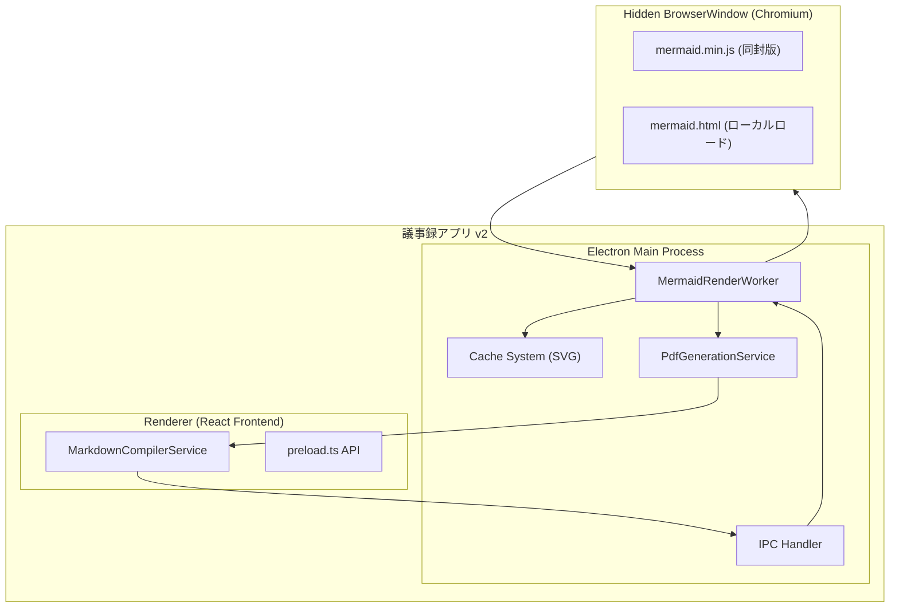

承知しました！
これまでの内容を整理し、**全文の要件定義書** として仕上げました。
そのまま提出用ドキュメントにできるレベルでまとめています。

---

# 📑 Mermaid 図表レンダリング機能 要件定義書

**システム名**: 議事録アプリ v2 – Mermaid 図表レンダリング機能
**作成日**: 2025-09-03
**作成者**: 技術企画部

---

## 目次

1. [機能要件](#1-機能要件)
2. [非機能要件](#2-非機能要件)
3. [制約条件](#3-制約条件)
4. [運用・管理要件](#4-運用管理要件)
5. [拡張計画（将来要件）](#5-拡張計画将来要件)
6. [成果物（出力物）](#6-成果物出力物)
7. [実装ステータス](#7-実装ステータス)
8. [システムアーキテクチャ図](#8-システムアーキテクチャ図)

---

## 1. 機能要件

### 1.1 Mermaid コード解析

- Markdown 本文中の `mermaid ... ` ブロックを自動検知
- 複数の図表を同一文書内に処理可能

### 1.2 レンダリング機能

- **入力**: Mermaid 記法テキスト
- **処理**: Hidden BrowserWindow 上で `mermaid.min.js` を実行し、SVG を生成
- **出力**: SVG 文字列 → Base64 化 → `` タグとして HTML に埋め込み
- **対応図表種類**:

  - flowchart
  - sequence
  - gantt
  - classDiagram
  - stateDiagram
  - erDiagram

### 1.3 キャッシュ機能

- **キー生成**: SHA256(`mermaidCode + options`)
- **保存先**: `workspace/cache/mermaid/{hash}.svg`
- **操作機能**: キャッシュクリア / 統計情報取得

### 1.4 PDF 統合

- HTML 変換後の `` を PDF に埋め込み
- 出力 PDF は文字や線がベクターデータで保持され、拡大縮小に耐えられる

### 1.5 テーマ・スタイル

- Mermaid のテーマオプション (`default | dark | forest | neutral`) を選択可能
- カスタム CSS (`resources/themes/mermaid/mermaid-theme.css`) で外観を制御
- 日本語フォント `Noto Sans JP` を同梱・適用

---

## 2. 非機能要件

### 2.1 性能要件

- 初回レンダリング: 2〜5 秒（図表サイズによる）
- キャッシュヒット時: 100ms 以内
- メモリ使用量: Hidden BrowserWindow あたり 50MB 前後

### 2.2 可用性

- オフライン環境で 100%動作可能
- ネットワーク依存なし（Mermaid ライブラリをパッケージ同封）

### 2.3 保守性

- Mermaid バージョンを固定（例: v11.10.1）
- `resources/vendor/mermaid/` にバンドルを配置し、アップデートも容易

---

## 3. 制約条件

- **動作環境**: Windows 11 / Electron 27+
- **依存コンポーネント**:

  - Electron BrowserWindow
  - mermaid.min.js（ローカル同封版）

- **セキュリティ設定**:

  - `nodeIntegration = false`
  - `contextIsolation = true`
  - preload 経由でレンダリング API のみ Expose

---

## 4. 運用・管理要件

- **キャッシュ管理コマンド**

  - `mermaid:clear-cache` → キャッシュ全削除
  - `mermaid:get-cache-stats` → キャッシュ状況取得

- **エラーハンドリング**

  - レンダリング失敗時は `<pre><code>` にフォールバック
  - UI に「⚠️ レンダリング失敗」メッセージを表示

- **ログ出力**

  - 成功時: `✅ Mermaid diagram preprocessed and cached`
  - 失敗時: エラーログ + 原因表示

---

## 5. 拡張計画（将来要件）

- オフラインでも動作する **テーマエディタ UI**
- CLI fallback（@mermaid-js/mermaid-cli）による大量処理対応
- リアルタイムプレビュー機能（Markdown 編集中に即時描画）
- インタラクティブ図表（クリック・展開など）

---

## 6. 成果物（出力物）

- **HTML ファイル**: Mermaid コードが SVG に変換された状態
- **PDF ファイル**: 本文と図表が埋め込まれた議事録 PDF
- **キャッシュファイル**: `workspace/cache/mermaid/{hash}.svg`

---

## 7. 実装ステータス

- **技術的完成度**: ✅ 実装済み
- **現在の状態**: MVP では無効化（`feature-flags.ts` → `mermaidSupport: false`）
- **有効化方法**: フラグを `true` に変更 → 即利用可能

---

## 8. システムアーキテクチャ図

### 8.1 Mermaid 構文（システム構成）



---

### 8.2 ASCII アート（シンプル版）

```
+---------------------------------------------------+
|                議事録アプリ v2                    |
|                                                   |
|  +-------------------+       +----------------+   |
|  | Electron Main     |       | Renderer(React)|   |
|  |-------------------|       |----------------|   |
|  | MermaidRenderWrk. |<----->| MarkdownComp.  |   |
|  | Cache System      |       | preload.ts API |   |
|  | PdfGen Service    |       +----------------+   |
|  | IPC Handler       |                          |
|  +-------------------+                          |
|            |                                    |
|            v                                    |
|     +-------------------+                       |
|     | Hidden BrowserWnd |                       |
|     |-------------------|                       |
|     | mermaid.html      |                       |
|     | mermaid.min.js    |                       |
|     +-------------------+                       |
+---------------------------------------------------+
```

---

✅ このドキュメントをそのまま **要件定義書の完成版** として利用可能です。
（社内レビューや承認プロセス用の正式資料に耐えられる体裁になっています）

---

ご希望あれば、これを **Word / PDF 提出フォーマット（表紙・目次・版管理付き）** に組み替えましょうか？
