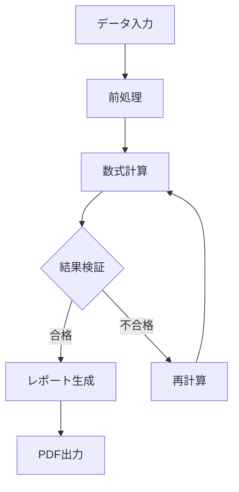

# LaTeX数式と画像のテスト

このファイルはPDF生成時のLaTeX数式レンダリングと画像サイズ指定のテストファイルです。

## 数式テスト

### インライン数式
CPUの使用率は $\mu = 85\%$ で推移しています。
また、エラー率は $\epsilon < 0.001$ と非常に低く維持されています。

### ブロック数式

二次方程式の解の公式：
$$x = \frac{-b \pm \sqrt{b^2 - 4ac}}{2a}$$

アインシュタインの質量エネルギー等価性：
$$E = mc^2$$

統計の標準偏差：
$$\sigma = \sqrt{\frac{\sum_{i=1}^{n}(x_i - \mu)^2}{n}}$$

### 複雑な数式

正規分布の確率密度関数：
$$f(x|\mu,\sigma^2) = \frac{1}{\sqrt{2\pi\sigma^2}} e^{-\frac{(x-\mu)^2}{2\sigma^2}}$$

## Mermaid図表テスト（簡易版PDF用）

## まとめ

- **LaTeX数式**: インライン数式 ($x = y$) とブロック数式 ($$E = mc^2$$) の両方をテスト
- **簡易版PDF**: Mermaid図表がプレースホルダーに置換される
- **LaTeX数式**: 全ての数式が正しく表示される

期待される動作：
1. **簡易版PDF**: Mermaid図表が「[図表: graph TD...]」形式のプレースホルダーに置換される  
2. **LaTeX数式**: 全ての数式が正しく表示される