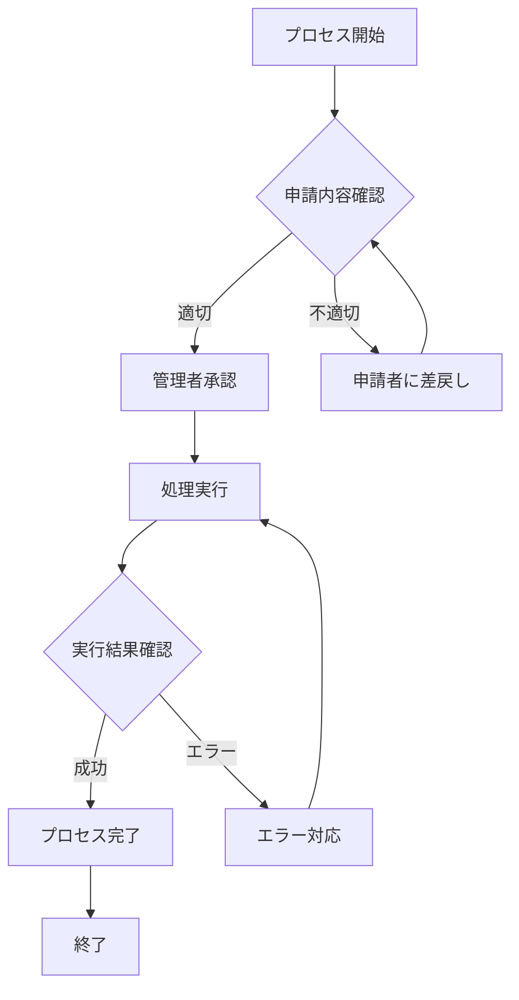
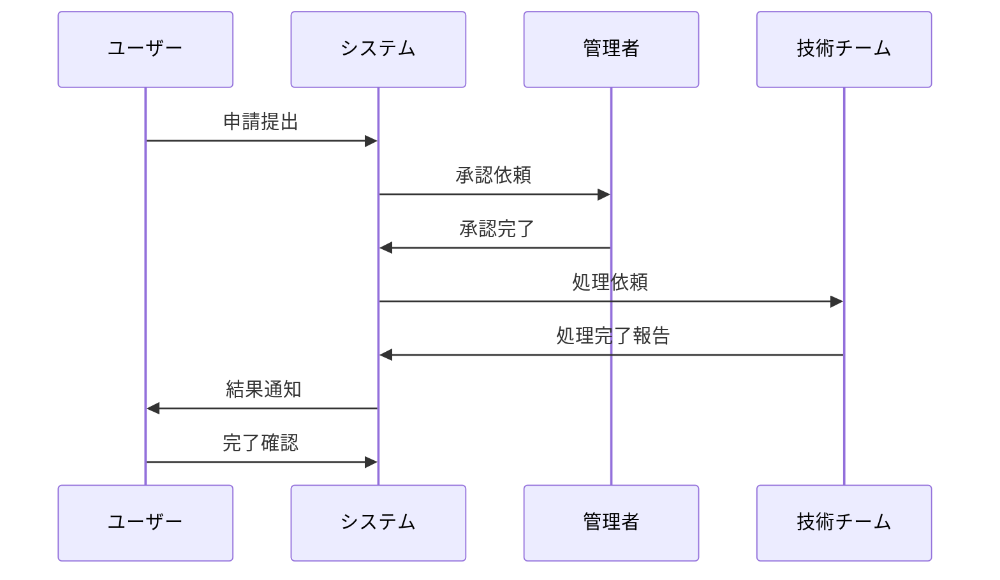
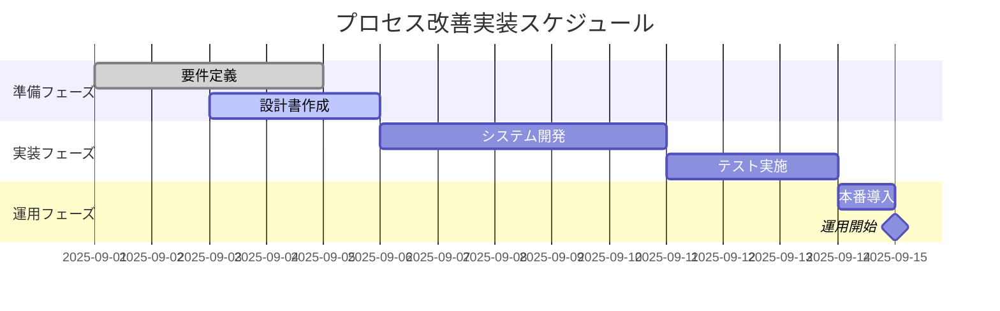

# 📊 プロセス改善会議 議事録

**日時**: 2025年9月2日  
**参加者**: 田中、佐藤  
**議題**: ワークフロー改善・図表による可視化

## 📈 現在のワークフロー

現在のプロセスフローは以下の通りです：

## 🤝 チーム間連携フロー

部署間の連携は以下のシーケンスで行われます：

## 📅 実装スケジュール

プロセス改善の実装スケジュール：

## 📝 会議結論

1. **フローチャート**: プロセスの可視化により問題点が明確化
2. **シーケンス図**: チーム間連携の効率化方法を特定
3. **ガントチャート**: 実装スケジュールを具体的に設定

### 次回アクション
- [ ] エラー処理フローの詳細検討
- [ ] チーム間連携ツールの選定
- [ ] 実装スケジュールの承認取得

---
**作成者**: 議事録システム  
**図表**: Mermaid.js使用